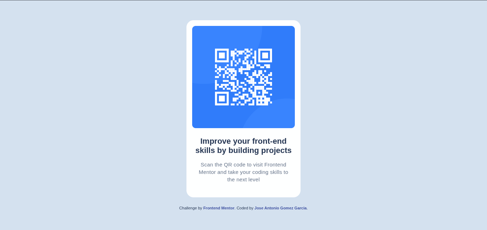

# Frontend Mentor - QR code component solution

This is a solution to the [QR code component challenge on Frontend Mentor](https://www.frontendmentor.io/challenges/qr-code-component-iux_sIO_H). Frontend Mentor challenges help you improve your coding skills by building realistic projects.

## Table of contents

- [Overview](#overview)
  - [Screenshot](#screenshot)
  - [Links](#links)
- [My process](#my-process)
  - [Built with](#built-with)
  - [What I learned](#what-i-learned)
  - [Continued development](#continued-development)
  - [Useful resources](#useful-resources)
- [Author](#author)
- [Acknowledgments](#acknowledgments)

## Overview

### Screenshot



### Links

- Solution URL: (https://github.com/JAGG13/Qr-Component/tree/main)
- Live Site URL: (https://qr-component-jagg13.netlify.app)

## My process

First, I read the README file to determine where to start, then I reviewed the style requirements in both the style guide and Figma. I adjusted the HTML by creating a `div` to hold the QR card and splitting the text into two `<p>` elements; subsequently, I created the `styles.css` file to apply formatting based on the requirements, researching ways to adjust the page exactly as requested.

### Built with

- Semantic HTML5 markup
- CSS custom properties
- Flexbox
- CSS Grid

### What I learned

As for the HTML, I decided to add a `<div>` to wrap the entire card, making it easier to adjust and style that specific group of elements.

```html
<div class="qr">
  
  <p id="bold">Improve your front-end skills by building projects</p>
  <p id="regular">
    Scan the QR code to visit Frontend Mentor and take your coding skills to the
    next level
  </p>
</div>
```

I am happy with this part of the code, as I was able to separate the two `<p>` tags using different IDs and edit them independently—specifically, styling the "Bold" ID without affecting the rest:

```css
#bold {
  color: hsl(218, 44%, 22%);
  font-size: 22px;
  font-weight: 700;
  line-height: 120%;
  letter-spacing: 0%;
  margin-top: 24px;
  margin-bottom: 16px;
  padding: 0 8px;
}
```

### Continued development

I would like to keep practicing with CSS so I can perfectly understand how to style pages just by looking at the final design.

### Useful resources

- [Flexbox Froggy](https://flexboxfroggy.com) - This helped me for understand how flexbox works. I really liked this way to practice my css.

- [How to link font-styles in html](https://stackoverflow.com/questions/74154830/linking-fonts-to-font-face-through-html) - This helped me for understand how to link a new font style in my html file, in this case for the Outfit font style.

## Author

- My GitHub- [Jose Antonio Gomez Garcia](https://www.your-site.com)
- Frontend Mentor - [JAGG13](https://www.frontendmentor.io/profile/JAGG13)

## Acknowledgments

Thanks to Goku for save the Planet.
